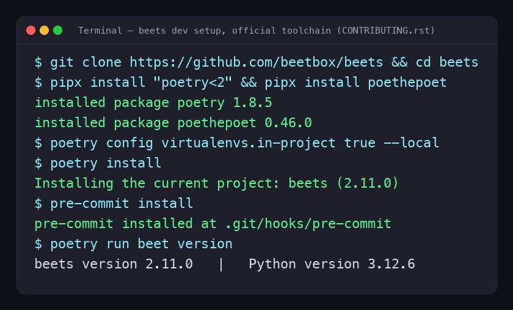
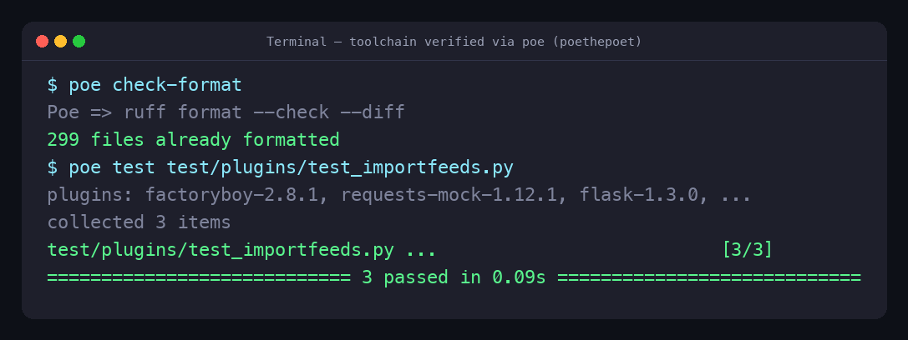
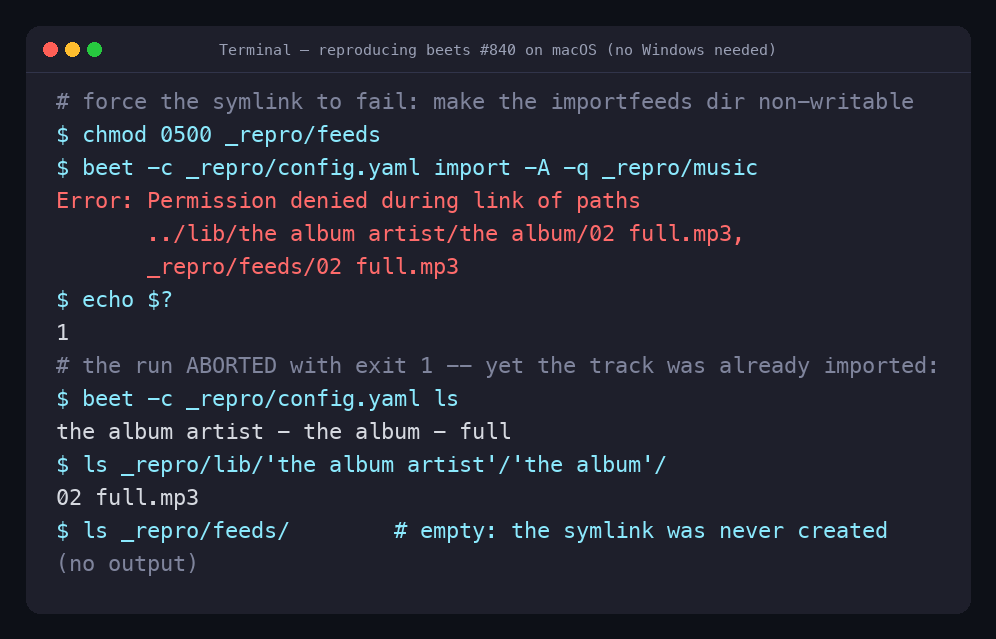

# Contribution #1: ImportFeeds — catch symlink failures on Windows (beets #840)

**Contribution Number:** 1  
**Student:** Temitope S. Olugbemi  
**Issue:** https://github.com/beetbox/beets/issues/840  
**Status:** Phase II complete — reproduced on macOS, root cause confirmed, and the official `poetry` / `poe` / `pre-commit` dev environment is set up per `CONTRIBUTING.rst`. Starting Phase III (regression test + fix).

---

## Why I Chose This Issue

I chose issue [#840 "ImportFeeds: fix/disable/catch symlink usage on windows"](https://github.com/beetbox/beets/issues/840) in [beetbox/beets](https://github.com/beetbox/beets) because it is a real, well-scoped bug in Python — one of the languages I work in most — and it lets me practice exactly the skills I want to build in this program: reading an unfamiliar, mature codebase, fixing a defect cleanly, and writing a regression test that proves the fix. It is labeled `bug` and `good first issue`, and the maintainer already described the intended fix in the thread ("we should catch and skip this"), so the acceptance criteria are clear.

I'm interested in this because:

1. **It's squarely in my skill set.** The fix is a focused change to a single Python plugin file (`beetsplug/importfeeds.py`) plus a test — no framework or domain knowledge I'd have to ramp up from scratch.
2. **The scope is contained.** It's a small, bounded defect (a missing `try/except` around one filesystem call), not an open-ended feature — a realistic first contribution.
3. **The project is active and the area is well-supported.** beets is pushed to almost daily, has a thorough `CONTRIBUTING.rst`, and there is a recently merged, nearly identical fix (the fetchart `OSError` handling in PR #6662) that I can use as a template for the fix, the test, and the changelog entry.
4. **It matches my learning goals.** I want to get comfortable with Python error handling and filesystem edge cases, with mock-based regression testing, and with the full open-source PR/review workflow — and this issue exercises all three.

From reading the issue thread and the code, I understand the current problem: when the importfeeds plugin is configured with `formats: link`, a failure to create a symlink (for example on Windows, where creating one requires elevated privilege) raises out of `beets.util.link()` and **aborts the entire `beet import` run** — even though the music files were already imported. My contribution will catch that failure, log a clear per-item warning, and let the import continue, making the plugin resilient on Windows instead of crashing.

I have already left a comment on the issue introducing myself as a CodePath AI301 student, summarizing the fix I plan to make, and asking the maintainer a scoping question (whether to catch `beets.util.FilesystemError` — what the helper actually raises — versus a broader `OSError`).

---

## Understanding the Issue

### Problem Description

When the `importfeeds` plugin is configured with `formats: link`, it creates a
symbolic link for each imported track. Creating that symlink can fail —
classically on Windows, where making a symlink requires elevated privilege, but
also on **any** OS when the destination directory isn't writable or the
filesystem doesn't support symlinks. The failing call is **not wrapped in a
`try/except`**, so the exception propagates out of the import pipeline and
**aborts the entire `beet import` run** — even though the tracks were already
imported into the library.

### Expected Behavior

One track's symlink failing should not sink the whole import. The plugin should
log a clear, per-item warning naming the offending path and **continue**, so the
import finishes successfully. This is exactly what the maintainer asked for in
the thread ("catch and skip").

### Current Behavior

`beet import` exits with status `1` and prints
`Error: Permission denied during link of paths …`. The music is already copied
into the library and recorded in the database, but the command reports failure
and stops — leaving the user unsure whether the import worked. (See
[Reproduction Evidence](#reproduction-evidence): DB has the track, library has
the file, feeds dir is empty, command failed.)

### Affected Components

- `beetsplug/importfeeds.py` → `ImportFeedsPlugin._record_items()` — the
  **unguarded `link(path, dest)` call at line 131** (method defined at line 94;
  `link` imported at line 27).
- `beets/util/__init__.py` → `link()` (line 552) — wraps the OS-level
  `OSError` / `NotImplementedError` into `beets.util.FilesystemError`
  (lines 571–572).
- `beets.util.FilesystemError` (line 129) — subclass of `HumanReadableError` →
  `Exception`; **not** an `OSError`. (So a fix catching only `OSError` would
  miss it.)

---

## Reproduction Process

### Environment Setup

I work on macOS with Python 3.12.6. I set beets up exactly as `CONTRIBUTING.rst`
prescribes — `poetry` + `poethepoet` (installed with `pipx`) and `pre-commit`:

```bash
git clone https://github.com/beetbox/beets && cd beets
pipx install "poetry<2"        # version pin matches beets' [tool.pipx-install]
pipx install poethepoet        # the `poe` task runner
poetry config virtualenvs.in-project true --local
poetry install                 # beets + the test/lint/typing/release groups
pre-commit install             # git hook: runs `poe format` on commit

# verify the toolchain
poe check-format               # ruff format --check  -> "299 files already formatted"
poe test test/plugins/test_importfeeds.py   # 3 passed
poetry run beet version        # beets 2.11.0 / Python 3.12.6
```


*The official contributor toolchain — poetry 1.8.5 + poethepoet 0.46.0 +
pre-commit, with an in-project `.venv`.*


*Toolchain verified — `poe check-format` is clean and the existing `importfeeds`
tests pass via `poe test`.*

**Setup challenges I hit (and how I solved them):**

1. **The bug is reported on Windows, but I'm on macOS.** Instead of a Windows VM,
   I reproduced the same code path by making the symlink fail another way — a
   non-writable destination dir (`util.link()` raises `FilesystemError` on *any*
   failed symlink). I confirmed the mechanism with a 6-line `os.symlink` probe
   (`PermissionError`/EACCES) first. *(That initial quick reproduction used a
   throwaway `python -m venv`; I then replaced it with the poetry setup above for
   the actual contribution.)*
2. **`pipx`/`poetry` weren't installed, and the poetry version is pinned.** I
   installed them with `pipx` and pinned `poetry<2` to match beets'
   `[tool.pipx-install]`. `pipx` warned its launcher dir wasn't on `PATH`; I run
   it as `python3 -m pipx`, while `poetry`/`poe` live in `~/.local/bin` (already
   on PATH). `pipx ensurepath` fixes new shells.
3. **`poe` must find the project venv.** I set `virtualenvs.in-project true`, so
   the venv is `beets/.venv` and `poe`'s auto-executor runs `ruff`/`pytest` from
   it — which is also why the `pre-commit` hook's bare `poe format` works.
4. **Version drift.** The 2014 traceback in the issue is beets 1.3.6 / Python
   2.7; today's beets is 2.11.0 and the tree is reorganized (tests now live
   under `test/plugins/`). I reproduced the *current* equivalent.
5. **`mock.patch` target gotcha (for the regression test).** Because
   `importfeeds` does `from beets.util import … link`, the name must be patched
   where it's used — `beetsplug.importfeeds.link`, not `beets.util.link`.

### Steps to Reproduce

On macOS/Linux, force the symlink to fail by pointing `importfeeds` at a
read-only directory:

1. Configure beets with `formats: link` and a feeds `dir` (see `config.yaml`).
2. Make the feeds dir non-writable: `chmod 0500 <feeds dir>`.
3. Import a track: `poetry run beet -c config.yaml import -A -q <music dir>`
   (`-A` = no autotag, `-q` = no prompts).
4. **Observed:** the command prints `Error: Permission denied during link of
   paths …` and exits `1` — but the track is already in the library.

```yaml
# config.yaml
directory: _repro/lib
library:   _repro/lib.db
import: { copy: yes, write: no }
plugins: importfeeds
importfeeds:
  formats: link
  dir: _repro/feeds
```

### Reproduction Evidence


*The import aborts with exit `1` on the unhandled link error — yet `beet ls`
shows the track was imported and the file was copied into the library, while the
feeds dir is empty (the symlink was never created). Work done, but the run
fails.*

- **Trigger:** a read-only `importfeeds.dir` makes `os.symlink` raise
  `PermissionError` (EACCES), which `util.link()` wraps into `FilesystemError`.
- **My findings:**
  - The crash is **not** Windows-specific — it's a missing `try/except` around a
    fallible filesystem call. Windows is just the most common trigger.
  - The exception that actually escapes is `beets.util.FilesystemError`, **not**
    `OSError`. A fix catching only `OSError` would not work — this resolves the
    scoping question I asked the maintainer.
  - The import is only *partially* transactional from the user's view: the
    DB/library are updated, then the command fails — confusing behavior the fix
    will eliminate.

---

## Solution Approach

### Analysis

Root cause: `ImportFeedsPlugin._record_items()` calls `link(path, dest)`
(`beetsplug/importfeeds.py:131`) with no exception handling. `beets.util.link()`
raises `beets.util.FilesystemError` whenever the symlink can't be created
(`beets/util/__init__.py:571-572`). Because `_record_items` runs inside an
import-event listener (`album_imported` / `item_imported`), the unhandled
exception propagates up through the importer and aborts the whole run. The fix
belongs in `importfeeds` — catch `FilesystemError`, warn, continue — which
addresses the missing-error-handling **root cause** rather than the Windows
**symptom**.

### Proposed Solution

Wrap the `link(path, dest)` call in `try/except beets.util.FilesystemError`, emit
a per-item `self._log.warning(...)` that names the path, and `continue` to the
next item so the import completes. Add a regression test that simulates the
failure with `mock.patch`. This mirrors patterns already in the codebase (see
**Match**).

### Implementation Plan

Using UMPIRE framework (adapted):

**Understand:** With `formats: link`, a single failed symlink raises
`FilesystemError` out of `_record_items` and aborts the whole `beet import`,
even though the tracks were already imported. Desired behavior is
warn-and-continue. The failure is OS-agnostic (Windows privilege is the common
trigger; a read-only dir reproduces it on macOS). Confirmed by reproducing it
locally — exit `1` + `Error: Permission denied during link…`, with the library
nonetheless populated (see Reproduction Evidence).

**Match:** beets already contains the exact pattern I need (verified against the
local clone at commit `60047df`):

- **`beetsplug/playlist.py:139-142`** — `try: … except beets.util.FilesystemError:
  self._log.error(...)` then continues the loop. *Closest structural twin to my
  fix.*
- **`beetsplug/fetchart.py:1504-1513`** (the #6193 fix, PR #6662) —
  `except OSError as exc: self._log.warning("… {0.album}: {1}", album, exc);
  return False`. *Best warn-and-skip template; uses `.warning`, the level I
  want.*
- **`beetsplug/fetchart.py:516-521`** —
  `except util.FilesystemError as exc: self._log.debug(...)`. *Confirms the
  `as exc` + format-string logging idiom.*
- **Exception source:** `beets/util/__init__.py:552-572` — `link()` (and
  `copy/move/hardlink`) wrap OS errors into `FilesystemError`, which carries
  `.paths` and is human-readable.
- **Test template:** `test/plugins/test_fetchart.py:123-135`
  (`test_set_art_oserror_is_handled_gracefully`) —
  `with mock.patch(target, side_effect=Error): …` then assert graceful handling.

**Plan:**

1. In `beetsplug/importfeeds.py`, add `FilesystemError` to the
   `from beets.util import …` line (line 27).
2. In `_record_items` (line 131), guard the `link()` call:
   ```python
   if not os.path.exists(syspath(dest)):
       try:
           link(path, dest)
       except FilesystemError as exc:
           self._log.warning("could not create symlink for {}: {}", path, exc)
           continue
   ```
3. Add a regression test in `test/plugins/test_importfeeds.py` (mirrors fetchart;
   patch target verified as `beetsplug.importfeeds.link`):
   ```python
   from unittest import mock
   from beets.util import FilesystemError

   def test_link_failure_is_warned_not_fatal(self):
       self.config["importfeeds"]["formats"] = "link"
       album = Album(album="album/name", id=1)
       item = Item(title="song", album_id=1,
                   path=os.path.join("path", "to", "item.mp3"))
       self.lib.add(album); self.lib.add(item)
       with mock.patch(
           "beetsplug.importfeeds.link",
           side_effect=FilesystemError("simulated", "link", ("a", "b")),
       ):
           self.importfeeds.album_imported(self.lib, album)  # must NOT raise
   ```
4. Add a changelog bullet to the bottom of the **Bug fixes** list under
   *Unreleased* in `docs/changelog.rst`, matching house style:
   ```rst
   - :doc:`plugins/importfeeds`: ``beet import`` no longer aborts when a symlink
     cannot be created (e.g. on Windows or into a read-only directory); the
     failure is logged and the import continues. :bug:`840`
   ```
5. Run quality gates: `poe check-format`, `poe lint`, `poe test`,
   `poe check-types` (ruff line length 80).

**Implement:** *Pending — Phase III.* Develop via beets' official setup — fork
`beetbox/beets`, `poetry install`, `pre-commit install` — then branch
`fix/importfeeds-840-symlink` off the default branch; commits linked here as I
work. All GitHub communication on the issue/PR is handled by me personally, as
beets' AI-assistance policy requires ("AI as a tool, not a contributor").

**Review (self-checklist, from `CONTRIBUTING.rst`):**

- [ ] Catches `FilesystemError` (not `OSError`); warns and continues.
- [ ] Uses f-strings / the beets logging shim (`self._log`), `except A as B:`,
      no `print()`.
- [ ] Regression test added (pytest, `PluginTestCase`).
- [ ] Changelog entry added with `` :bug:`840` ``.
- [ ] `poe check-format`, `poe lint`, `poe test`, `poe check-types` all clean.
- [ ] Developed in the poetry env with `pre-commit` installed; lines ≤ 80 cols.
- [ ] PR description fills `Fixes #840.` and crosses out `~Documentation~`.
- [ ] All GitHub communication handled by me (a human who understands the fix),
      per beets' AI-assistance policy.

> Full governance checklist (CONTRIBUTING / README / SECURITY / CODE OF CONDUCT):
> [`docs/beets-contribution-checklist.md`](docs/beets-contribution-checklist.md).

**Evaluate:** The fix is correct when (a) the new regression test passes and the
existing three importfeeds tests still pass; and (b) the manual repro above now
finishes with exit `0`, prints a warning instead of `Error:`, and the track is
imported (the feeds symlink simply skipped). I'll re-run both to confirm.

---

## Testing Strategy

### Unit Tests

- [ ] `test_link_failure_is_warned_not_fatal` (new regression test for #840):
      with `formats: link` and `beetsplug.importfeeds.link` patched to raise
      `FilesystemError`, `album_imported` completes without raising and logs a
      warning.
- [ ] Existing `test_multi_format_album_playlist`, `test_playlist_in_subdir`,
      `test_playlist_per_session` still pass (no regression).
- [ ] (Optional) assert the warning message names the offending path.

### Integration Tests

- [ ] Manual end-to-end: `beet import` with a read-only feeds dir now exits `0`,
      logs a warning, imports the track, and skips only the symlink.
- [ ] Happy path unchanged: with a *writable* feeds dir, the symlink is still
      created as before.

### Manual Testing

Reproduced the failure on macOS via a read-only feeds dir (exit `1` +
`Error: Permission denied during link…`, library populated, feeds empty — see
[Reproduction Evidence](#reproduction-evidence)). After the fix I'll re-run the
same steps and confirm exit `0` + warning + successful import.

---

## Implementation Notes

### Week 1 progress — reproduction & dev environment

- **Reproduced #840** locally on macOS (read-only feeds dir): `beet import`
  exits `1` with `Error: Permission denied during link…` while the track is
  still imported (see Reproduction Evidence). Root cause confirmed —
  `beetsplug/importfeeds.py:131` calls `link()` unguarded and
  `beets.util.link` raises `FilesystemError` (`beets/util/__init__.py:571`).
- **Set up the official contributor toolchain** (per `CONTRIBUTING.rst`):
  cloned beets 2.11.0; `pipx install "poetry<2"` + `poethepoet`; `pre-commit`;
  `poetry install` into an in-project `.venv`; `pre-commit install`.
- **Verified:** `poe check-format` → "299 files already formatted";
  `poe test test/plugins/test_importfeeds.py` → 3 passed; `beet version` →
  2.11.0 / Python 3.12.6.
- **Next:** write the failing regression test, then the fix (Phase III).

### Week [Y] Progress

[Continue documenting as you work]

### Code Changes

- **Files modified:** [List]
- **Key commits:** [Links to important commits]
- **Approach decisions:** [Why you chose certain approaches]

---

## Pull Request

**PR Link:** [GitHub PR URL when submitted]

**PR Description:** [Draft or final PR description - much of the content above can be adapted]

**Maintainer Feedback:**
- [Date]: [Summary of feedback received]
- [Date]: [How you addressed it]

**Status:** [Awaiting review / Iterating / Approved / Merged]

---

## Learnings & Reflections

### Technical Skills Gained

[What you learned technically]

### Challenges Overcome

[What was hard and how you solved it]

### What I'd Do Differently Next Time

[Reflection on your process]

---

## Resources Used

- Issue thread: [beets #840](https://github.com/beetbox/beets/issues/840)
- beets `CONTRIBUTING.rst` (the "code, tests, documentation, changelog" rule)
  and `docs/changelog.rst` (entry style: `` :bug:`NNNN` ``).
- Precedent code in the beets tree (warn/skip on `FilesystemError`):
  `beetsplug/playlist.py:139`, `beetsplug/fetchart.py:1504` (PR #6662 / #6193),
  `beetsplug/fetchart.py:516`.
- Exception source: `beets/util/__init__.py:552` (`link()`), `:129`
  (`FilesystemError`).
- Test template: `test/plugins/test_fetchart.py:123`
  (`test_set_art_oserror_is_handled_gracefully`).
- A detailed working copy of this analysis lives in
  [`docs/reproduction-plan-840.md`](docs/reproduction-plan-840.md).
